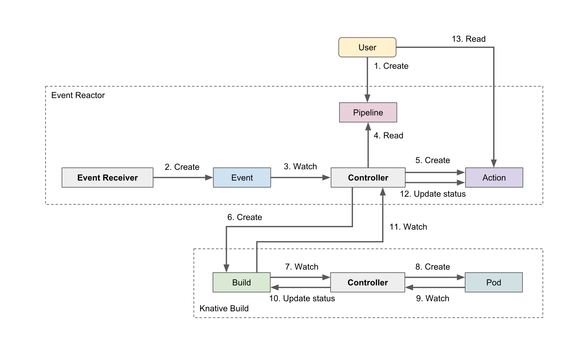

# Design Overview

Event Reactor is an event-driven container runner. This runs any containers as a reaction of the event. The user can specify which container to run for which event. Event Reactor is similar to [GitHub Actions](https://github.com/features/actions) but works on any Kubernetes cluster.

## Concept

Many tasks related to software development and operation are based on some event. For example, many development teams are running the tests when their code committed to the repository. In such a case, the code commit is an event.

We think that if we can automatically run any containers when events occur, we can automate various tasks. Event Reactor is developing based on this idea.

## Architecture

Event Reactor consists of several components and custom resources of Kubernetes.

### Custom Resources

Event Reactor uses the following Kubernetes custom resource.

- **Event** represents an event. It has metadata such as the type and the source, and the body of the event.
- **Pipeline** defines the processing to be run when an Event is created. It is an extension of Build resource of [Knative Build](https://github.com/knative/build/).
- **Action** represents the result of processing when receiving an event. It is created based on the contents of the Pipeline resource.

### Components

- **Controller** manages the state of custom resources. When a Event resource is created, controller reads Pipeline resources and creates Actions based on the content of Pipeline. It runs on their own namespace and manages custom resources in the all namespaces.
- **Event Receiver** receives [CloudEvents](https://cloudevents.io/) formatted event from external event sources and creates Event resource. It runs on any namespace and manages Event resources in the same namespace.
- **Resource Cleaner** deletes expired Event and Action resource. It will prevent Kubernetes resources from becoming bloated. Resource Cleaner runs as a job on any namespace and removes the resources in the same namespace.
- **reactorctl** is a command-line tool for managing Event Reactor's resouces. Users can use this to check the details of Event and the execution result of Action.

## Workflow

The basic workflow of running containers with Event Reactor is as follows.

1. User creates a pipeline resource that defines which event to run and how to run the container.
2. When *Event Receiver* receives an event from the event source, it creates an Event resource.
3. *Controller* watches the Event resource and starts execution of the pipeline.
4. *Controller* reads the Pipeline resource and determines the pipeline to be run corresponding to the Event.
5. *Controller* creates an Action resource based on the content of the Pipeline resource.
6. *Controller* creates an Build resource based on the content of the Action resource.
7. *Knative Build Controller* watches the creation of the Build resource and starts creating Pod.
8. *Knative Build Controller* creates a Pod resource based on the content of the Build resource.
9. *Knative Build Controller* watches the status update of Pod resources.
10. *Knative Build Controller* updates the status of the Build resource when Pod is completed.
11. *Controller* watches the status update of Build resources.
12. *Controller* updates the status of the Action resource when Build is updated.
13. User checks the result of the Action and reads their logs.
